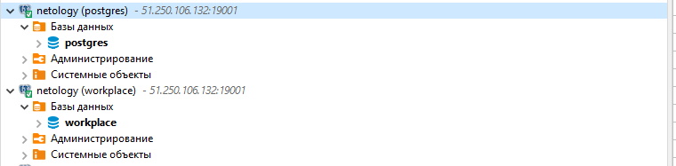

# Модуль 1. Домашнее задание по теме «Введение в SQL и установка ПО»

## Основная часть

### Задание 1. Создайте новое соединение в DBeaver и подключите облачную базу данных с учебной базой данных dvd-rental согласно инструкции. Сделайте скриншот результата.
   


### Задание 2. Откройте ER-диаграмму таблиц учебной базы данных dvd-rental. Сделайте скриншот результата.


### Задание 3. Перечислите все таблицы учебной базы данных dvd-rental и столбцы, которые имеют ограничения первичных ключей для этих таблиц. Запишите решение в формате [таблицы](https://letsdocode.ru/sql-main/1-3.png):


4. Задание 4. Выполните SQL-запрос к учебной базе данных dvd-rental “SELECT * FROM country;”. Сделайте скриншот результата.


## Дополнительная часть

### Задание 1. Установите локальный сервер PostgreSQL, восстановите учебные данные согласно инструкции и повторите задания 2–4 из основной части домашнего задания на локальной базе данных. Сделайте все необходимые скриншоты. Если вы изначально установили локальный сервер, то можете сразу приступать к следующему заданию.


### Задание 2. С помощью SQL-запроса выведите в результат таблицу, содержащую названия таблиц и названия ограничений первичных ключей в этих таблицах. Для написания запроса используйте представление information_schema.table_constraints.


```sql
SELECT
 table_name,
 constraint_name
FROM information_schema.table_constraints
WHERE table_schema = 'public' AND constraint_type ILIKE 'PRIMARY%'
```
---
